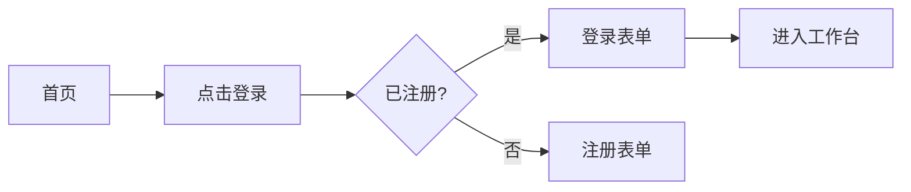

# UI/UX 设计技能（design-skill）

将 `.nds/01-requirements/` 的需求转化为**机器可读的契约化设计规范**——令牌驱动、组件 API 化、模式共享化，让开发能零歧义实现。

## 何时触发

- 用户输入 `/nzw-design`
- 自然语言提到"UI 设计/UX 设计/设计规范/设计令牌/高保真稿"等
- workflow-skill 在闭环中进入 design 阶段

## 工作目录与状态

**路径约定（v1.1）**：所有产出相对 `.nds/<active-req-id>/`，例如 `.nds/req-001/02-design/`。需求隔离见顶层 `.nds/index.json`。

产出落到 `.nds/<req-id>/02-design/`：
- `design-tokens.json` — W3C 设计令牌（Reference / System / Component 三层）
- `design-spec.md` — 设计规范主体
- `components/` — 每个组件一个 `.md`（规格）+ `.html`（高保真样例）
- `user-flows.md` — 用户流程图（mermaid）
- `hifi-pages/` — 关键页面高保真 HTML
- `interaction-notes.html` — 交互说明（HTML，可在浏览器查看）

入口动作：
1. 读取 `.nds/index.json` 确定 `active_req_id`（或用 `--req <id>` 指定），再读 `.nds/<req-id>/state.json`，确认 `phases.requirements.status == "done"`（否则提示先做需求）
2. `project.current_phase = "design"`，`phases.design.status = "in_progress"`；同步回写 `index.json` 中该 req 的 `current_phase`/`updated_at`
3. 完成后更新 state.json 与 `.nds/<req-id>/PROGRESS.md`、顶层 `.nds/PROGRESS.md`

## 主导思想

**"Tokens as contract, Components as API, Patterns as language."**

- 设计规范是机器可读契约，而非 PDF
- 令牌是设计意图与代码实现间的协议层
- 组件是带版本号的 API
- 模式是团队共享语言
- 目标：单向数据流 + 可逆向同步（design ↔ code），消除"设计稿与代码漂移"

## 执行流程

### 1. 设计令牌（design-tokens.json）

遵循 W3C Design Tokens Format Module，三层结构：

```json
{
  "$description": "项目设计令牌",
  "color": {
    "reference": {
      "slate-500": { "$value": "#64748b", "$type": "color" }
    },
    "system": {
      "text-primary":   { "$value": "{color.reference.slate-900}", "$type": "color" },
      "text-subtle":    { "$value": "{color.reference.slate-500}", "$type": "color" },
      "bg-canvas":      { "$value": "#ffffff", "$type": "color" },
      "bg-canvas-dark": { "$value": "#0f172a", "$type": "color" }
    },
    "component": {
      "button": {
        "primary":   { "bg": { "$value": "{color.system.accent}", "$type": "color" } },
        "secondary": { "bg": { "$value": "{color.system.muted}", "$type": "color" } }
      }
    }
  },
  "dimension": {
    "spacing": { "scale": { "$value": "4px", "$type": "dimension" } },
    "radius":  { "md": { "$value": "8px", "$type": "dimension" } }
  },
  "font": {
    "family": { "sans": { "$value": "system-ui, sans-serif", "$type": "fontFamily" } },
    "size":   { "md": { "$value": "16px", "$type": "dimension" } }
  },
  "duration": { "fast": { "$value": "150ms", "$type": "duration" } }
}
```

### 2. 设计规范文档（design-spec.md）

```markdown
# {{项目名}} 设计规范

## 1. 设计原则（3-5 条，如：清晰、一致、反馈、包容）
## 2. 设计令牌引用说明（指向 design-tokens.json）
## 3. 布局系统
  - 栅格、间距、断点（含 container query）
  - 响应式策略
## 4. 排版系统
## 5. 色彩系统（含暗色模式重映射规则）
## 6. 图标系统
## 7. 动效系统
## 8. 无障碍策略（WCAG 2.2 AA 起步）
## 9. 组件清单（指向 components/）
## 10. 模式（Patterns）清单
```

### 3. 组件规格（components/<name>.md）

每个组件包含：

```markdown
# Button 组件

## Anatomy（解剖）
- container
- label
- leadingIcon（可选）
- trailingIcon（可选）

## States
| 状态 | 视觉 | 行为 |
|---|---|---|
| default | ... | ... |
| hover | ... | ... |
| focus-visible | 2px outline | 键盘可达 |
| active | ... | ... |
| disabled | opacity 0.5 | 不响应 |
| loading | spinner | 不响应 |

## Props API
| Prop | 类型 | 默认 | 说明 |
|---|---|---|---|
| variant | 'primary'\|'secondary'\|'ghost' | 'primary' | |
| size | 'sm'\|'md'\|'lg' | 'md' | |
| disabled | boolean | false | |
| loading | boolean | false | |
| onClick | () => void | — | |

## Variants 矩阵
（表格列出所有 variant × size × state 组合）

## A11y 行为
- role="button"
- 键盘：Enter/Space 触发
- focus-visible 必备
- 对比度 ≥ 4.5:1

## Do / Don't
- ✓ 用于触发动作
- ✗ 不要用于导航（用 Link）
```

配套 `components/<name>.html` 高保真样例：真实令牌、真实数据、可复制结构。

### 4. 用户流程图（user-flows.md）

用 mermaid 表达关键流：



每条 flow 对应 PRD 中的 Story ID。

### 5. 高保真页面（hifi-pages/）

- 每个关键页面一个 HTML，浏览器直开
- 真实令牌（从 design-tokens.json 读取，CSS 变量化）
- 真实数据样例（不用 Lorem ipsum）
- 响应式（至少 3 个断点）
- 暗色模式切换按钮
- 无障碍：对比度、焦点、aria 标注

### 6. 交互说明（interaction-notes.html）

HTML 形式，含：
- 微交互（hover、click、loading、error）
- 表单校验时机与文案
- 空状态/错误状态/加载状态
- 路由跳转规则
- 动效时长与缓动

## 必须遵守的规则

1. **令牌分层三段式**：Reference → System → Component，禁止跨层引用跳跃。
2. **A11y 不可后补**：WCAG 2.2 AA 起步，对比度 4.5:1 / 3:1（大字号），focus-visible 必备，所有交互含 aria 与键盘可达。
3. **色彩令牌成对**：light/dark 都要，各自满足对比度。
4. **响应式用断点令牌 + container query**，间距用 4px/8px base scale，避免魔数。
5. **组件规格必须包含**：Anatomy / States / Props API / Variants / A11y / Do-Don't 六段，缺一不可。
6. **真实数据**：高保真稿不用占位文字，用符合业务的真实样例。

## 完成判定

- design-tokens.json 通过 JSON 校验，三层齐全
- design-spec.md 含 10 个段落
- 组件清单覆盖 PRD 中所有 Must 级 Story 涉及的 UI
- 至少 3 个高保真页面，含暗色模式
- user-flows.md 覆盖主用户流
- state.json 中 `phases.design.status = "done"`
- `resume_hint` 建议进入 review 阶段（`/nzw-review`）

## 与上下游交接

- 输入：`.nds/<req-id>/01-requirements/PRD.md`、`prototype.html`
- 输出给 review-skill：design-spec.md + components/ + hifi-pages/ 是三维评审中 UX 可实现性维度的对象
- 输出给 dev-skill：design-tokens.json 与组件规格是开发实现的契约
