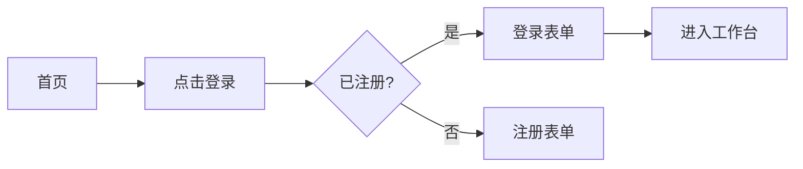

# UI/UX 设计技能（design-skill）

将 `.nds/01-requirements/` 的需求转化为**机器可读的契约化设计规范**——令牌驱动、组件 API 化、模式共享化，让开发能零歧义实现。

## 何时触发

- 用户输入 `/nzw-design`
- 自然语言提到"UI 设计/UX 设计/设计规范/设计令牌/高保真稿"等
- workflow-skill 在闭环中进入 design 阶段

## 工作目录与状态

**路径约定（v1.1）**：所有产出相对 `.nds/<active-req-id>/`，例如 `.nds/req-001/02-design/`。需求隔离见顶层 `.nds/index.json`。

产出落到 `.nds/<req-id>/02-design/`：
- `design-tokens.json` — W3C 设计令牌（Reference / System / Component 三层）
- `design-spec.md` — 设计规范主体
- `components/` — 每个组件一个 `.md`（规格）+ `.html`（高保真样例）
- `user-flows.md` — 用户流程图（mermaid）
- `hifi-pages/` — 关键页面高保真 HTML
- `interaction-notes.html` — 交互说明（HTML，可在浏览器查看）

入口动作：
1. 读取 `.nds/index.json` 确定 `active_req_id`（或用 `--req <id>` 指定），再读 `.nds/<req-id>/state.json`，确认 `phases.requirements.status == "done"`（否则提示先做需求）
2. **执行 impeccable 前置**（见「设计执行引擎 → 0. 前置」）：检测 impeccable 是否已安装，缺失则 `npx impeccable install` 自动安装后继续；安装失败则降级到内置精要规则
3. `project.current_phase = "design"`，`phases.design.status = "in_progress"`；同步回写 `index.json` 中该 req 的 `current_phase`/`updated_at`
4. 完成后更新 state.json 与 `.nds/<req-id>/PROGRESS.md`、顶层 `.nds/PROGRESS.md`

## 主导思想

**"Tokens as contract, Components as API, Patterns as language."**

- 设计规范是机器可读契约，而非 PDF
- 令牌是设计意图与代码实现间的协议层
- 组件是带版本号的 API
- 模式是团队共享语言
- 目标：单向数据流 + 可逆向同步（design ↔ code），消除"设计稿与代码漂移"

## 设计执行引擎：impeccable

本技能负责**契约层**（令牌、组件 API、流程、规范文档）；视觉与交互的**实现层**委托给 [impeccable](https://github.com/pbakaus/impeccable)（Apache-2.0，作者 Paul Bakaus）——一套面向前端的设计流利度技能，含 23 个子命令（`init`/`shape`/`craft`/`critique`/`audit`/`polish`/`bolder`/`quieter`/`animate`/`colorize`/`typeset`/`layout`/`extract`/`document`/`live`…）与 44 条确定性反模式检测规则。

> 归属：impeccable © Paul Bakaus，Apache License 2.0。本仓库仅引用其方法论与安装方式，不二次分发其源码。

### 0. 前置：确保 impeccable 已安装（缺失则自动安装）

进入设计实现前**必须**先确认 impeccable 可用，否则自动安装后继续：

1. 检测以下任一存在即视为已安装：
   - 项目内 `.claude/skills/impeccable/SKILL.md`
   - 用户级 `~/.claude/skills/impeccable/SKILL.md`
   - `/impeccable` 斜杠命令可用
2. 若均不存在，在**项目根目录**自动执行安装（不要询问，装完即继续）：
   ```bash
   npx impeccable install
   ```
   - 安装后重新检测，确认 `impeccable` 已就绪。
3. 降级路径：仅当 `npx` 不可用或安装失败时，回退到本技能内置的「impeccable 精要规则」手工产出设计稿，并在 `design-spec.md` 顶部注明「impeccable 未安装，按精要规则降级实现」，提示用户后续可 `npx impeccable install` 获得完整能力（live 浏览器迭代、detector、palette 脚本等）。

> impeccable 的 setup 流程要求先运行 `node .claude/skills/impeccable/scripts/context.mjs` 读取/生成 `PRODUCT.md`、`DESIGN.md`。nzw 场景下若 `.nds/<req-id>/01-requirements/PRD.md` 已存在，可将其作为 PRODUCT 上下文喂给 impeccable，避免重复采集。

### 1. 分支判定：新项目 vs 已有项目

判定信号——扫描项目代码，是否已存在**已提交的** CSS 令牌 / 主题 / 品牌色 / 现成页面与组件：

| 信号 | 判定 |
|---|---|
| 存在 `tokens.*` / `theme.*` / tailwind config / CSS 变量定义 / 现成页面与组件 | **已有项目** |
| 仅有脚手架、无任何设计系统或品牌色 | **新项目** |

### 2-A. 已有项目 → impeccable + 当前项目页面风格（identity-preservation 优先）

**核心原则：不要重造风格，用项目已有的令牌与组件作为锚，impeccable 负责保持一致地扩展。**

1. 读取当前页面风格：扫描现有 CSS / tokens / theme / 代表性组件与页面，记录配色、字体、间距、圆角、动效、组件结构。
2. 运行 `/impeccable document` 从现有代码生成 `DESIGN.md`，捕获当前视觉系统；必要时 `/impeccable extract` 把可复用令牌与组件抽入设计系统。
3. 以现有令牌为约束，用 `/impeccable shape` 规划新页面 UX/UI，`/impeccable craft` 实现；新产出必须复用既有色板、字体、间距尺度、组件 API，不得引入与原项目冲突的新令牌。
4. 将抽取/对齐后的令牌回写为 nzw `design-tokens.json`（Reference → System → Component 三层），**保留原项目命名与色值**（identity-preservation 胜过 impeccable 默认调色板）。
5. `/impeccable critique` + `/impeccable audit` 对新页面做一致性/可达性/性能自检，评分写入 `design-spec.md`。

### 2-B. 新项目 → impeccable 从零设计

1. `/impeccable init` 写 `PRODUCT.md`/`DESIGN.md`，确定 register（brand 营销/落地页/作品集 vs product 应用/仪表盘/工具）。
2. 运行 `node .claude/skills/impeccable/scripts/palette.mjs` 取品牌种子色，按 OKLCH 构建调色板（bg/surface/ink/accent/muted）。
3. `/impeccable shape` 规划 UX/UI，`/impeccable craft` 实现关键页面；遵循 impeccable「新项目」色与主题规则（OKLCH、明确色策略、避免 2026 饱和的 cream/sand 默认底色）。
4. 将 impeccable 调色板 / 排版 / 动效映射为 nzw `design-tokens.json` 三层令牌。

### 3. 输出映射（impeccable ↔ nzw 产物）

| impeccable 产物 | nzw 落位 |
|---|---|
| `PRODUCT.md` / `DESIGN.md` | 摘要并入 `design-spec.md` 的设计原则与色彩/排版/动效系统段落 |
| 调色板 / 令牌 / palette.mjs 输出 | `design-tokens.json`（Reference→System→Component 三层） |
| `/impeccable craft` 产出的页面 | `hifi-pages/*.html`（注入真实令牌 CSS 变量、真实数据、响应式、暗色模式、a11y） |
| `/impeccable craft` 产出的组件 | `components/<name>.md`（规格）+ `components/<name>.html`（高保真样例） |
| `/impeccable critique` / `audit` 评分与发现 | `design-spec.md`「设计自检」段落 + `interaction-notes.html` 中的微交互修正 |
| `/impeccable live` 浏览器迭代结果 | 替换对应 `hifi-pages/` 与 `components/` 文件 |

### 4. impeccable 精要规则（降级时亦须遵循）

即便 impeccable 未安装而降级，以下规则为硬约束（完整版见 impeccable `reference/` 与 SKILL.md）：

- **颜色**：正文对比度 ≥ 4.5:1，大字（≥18px 或 bold ≥14px）≥ 3:1，占位符同样 4.5:1；用 OKLCH；灰字压在彩色底上必失败，改用底色同色相的更深色或文字色透明度。
- **排版**：正文行宽 65–75ch；字体配对走对比轴（衬线+无衬线 / 几何+人文），勿用相似字体；display 标题 `clamp()` 上限 ≤ 6rem，letter-spacing ≥ -0.04em；`text-wrap: balance`（h1–h3）/ `pretty`（长文）。
- **布局**：间距有节奏不均一；卡片是偷懒答案、嵌套卡片必错；1D 用 Flex、2D 用 Grid；无断点响应网格用 `repeat(auto-fit, minmax(280px, 1fr))`；语义化 z-index 层级（dropdown < sticky < modal-backdrop < modal < toast < tooltip），禁用 999/9999。
- **动效**：意图化、非事后补丁；勿动画化布局属性；ease-out 用指数曲线（quart/quint/expo），无 bounce/elastic；`prefers-reduced-motion` 必备；reveal 动画必须增强已可见的默认态，不得用 class 触发 gating 内容可见性。
- **绝对禁止**（match-and-refuse，命中即重写结构）：侧边条边框（`border-left/right` > 1px 做彩色强调）、渐变文字（`background-clip:text`+渐变）、装饰性玻璃拟态、hero-metric 模板（大数字+小标签+渐变）、雷同卡片网格、每节上方小号大写 tracked eyebrow、`01/02/03` 编号脚手架（非真实有序流时）、文字溢出容器。
- **AI slop 测试**：若有人能一眼断定「AI 做的」即失败。两层反射检查：从品类能猜出主题+色板（一阶反射）、从品类+反例能猜出审美家族（二阶反射），均需重做直到答案不再显然。

## 执行流程

### 1. 设计令牌（design-tokens.json）

遵循 W3C Design Tokens Format Module，三层结构：

```json
{
  "$description": "项目设计令牌",
  "color": {
    "reference": {
      "slate-500": { "$value": "#64748b", "$type": "color" }
    },
    "system": {
      "text-primary":   { "$value": "{color.reference.slate-900}", "$type": "color" },
      "text-subtle":    { "$value": "{color.reference.slate-500}", "$type": "color" },
      "bg-canvas":      { "$value": "#ffffff", "$type": "color" },
      "bg-canvas-dark": { "$value": "#0f172a", "$type": "color" }
    },
    "component": {
      "button": {
        "primary":   { "bg": { "$value": "{color.system.accent}", "$type": "color" } },
        "secondary": { "bg": { "$value": "{color.system.muted}", "$type": "color" } }
      }
    }
  },
  "dimension": {
    "spacing": { "scale": { "$value": "4px", "$type": "dimension" } },
    "radius":  { "md": { "$value": "8px", "$type": "dimension" } }
  },
  "font": {
    "family": { "sans": { "$value": "system-ui, sans-serif", "$type": "fontFamily" } },
    "size":   { "md": { "$value": "16px", "$type": "dimension" } }
  },
  "duration": { "fast": { "$value": "150ms", "$type": "duration" } }
}
```

### 2. 设计规范文档（design-spec.md）

```markdown
# {{项目名}} 设计规范

## 1. 设计原则（3-5 条，如：清晰、一致、反馈、包容）
## 2. 设计令牌引用说明（指向 design-tokens.json）
## 3. 布局系统
  - 栅格、间距、断点（含 container query）
  - 响应式策略
## 4. 排版系统
## 5. 色彩系统（含暗色模式重映射规则）
## 6. 图标系统
## 7. 动效系统
## 8. 无障碍策略（WCAG 2.2 AA 起步）
## 9. 组件清单（指向 components/）
## 10. 模式（Patterns）清单
```

### 3. 组件规格（components/<name>.md）

每个组件包含：

```markdown
# Button 组件

## Anatomy（解剖）
- container
- label
- leadingIcon（可选）
- trailingIcon（可选）

## States
| 状态 | 视觉 | 行为 |
|---|---|---|
| default | ... | ... |
| hover | ... | ... |
| focus-visible | 2px outline | 键盘可达 |
| active | ... | ... |
| disabled | opacity 0.5 | 不响应 |
| loading | spinner | 不响应 |

## Props API
| Prop | 类型 | 默认 | 说明 |
|---|---|---|---|
| variant | 'primary'\|'secondary'\|'ghost' | 'primary' | |
| size | 'sm'\|'md'\|'lg' | 'md' | |
| disabled | boolean | false | |
| loading | boolean | false | |
| onClick | () => void | — | |

## Variants 矩阵
（表格列出所有 variant × size × state 组合）

## A11y 行为
- role="button"
- 键盘：Enter/Space 触发
- focus-visible 必备
- 对比度 ≥ 4.5:1

## Do / Don't
- ✓ 用于触发动作
- ✗ 不要用于导航（用 Link）
```

配套 `components/<name>.html` 高保真样例：真实令牌、真实数据、可复制结构。

### 4. 用户流程图（user-flows.md）

用 mermaid 表达关键流：



每条 flow 对应 PRD 中的 Story ID。

### 5. 高保真页面（hifi-pages/）

- 每个关键页面一个 HTML，浏览器直开
- 真实令牌（从 design-tokens.json 读取，CSS 变量化）
- 真实数据样例（不用 Lorem ipsum）
- 响应式（至少 3 个断点）
- 暗色模式切换按钮
- 无障碍：对比度、焦点、aria 标注

### 6. 交互说明（interaction-notes.html）

HTML 形式，含：
- 微交互（hover、click、loading、error）
- 表单校验时机与文案
- 空状态/错误状态/加载状态
- 路由跳转规则
- 动效时长与缓动

## 必须遵守的规则

1. **令牌分层三段式**：Reference → System → Component，禁止跨层引用跳跃。
2. **A11y 不可后补**：WCAG 2.2 AA 起步，对比度 4.5:1 / 3:1（大字号），focus-visible 必备，所有交互含 aria 与键盘可达。
3. **色彩令牌成对**：light/dark 都要，各自满足对比度。
4. **响应式用断点令牌 + container query**，间距用 4px/8px base scale，避免魔数。
5. **组件规格必须包含**：Anatomy / States / Props API / Variants / A11y / Do-Don't 六段，缺一不可。
6. **真实数据**：高保真稿不用占位文字，用符合业务的真实样例。
7. **impeccable 引擎优先**：视觉实现层委托 impeccable；缺失时按「impeccable 精要规则」降级，但精要规则中的「绝对禁止」与对比度/动效约束在任何模式下都是硬约束。
8. **已有项目身份保留**：已有项目分支下，impeccable 的默认调色板不得覆盖项目既有品牌色与令牌命名（identity-preservation 胜出）；新产出复用既有组件 API。
9. **AI slop 零容忍**：交付前过 impeccable「绝对禁止」清单与 AI slop 测试，命中任一即重写。

## 完成判定

- design-tokens.json 通过 JSON 校验，三层齐全
- design-spec.md 含 10 个段落
- 组件清单覆盖 PRD 中所有 Must 级 Story 涉及的 UI
- 至少 3 个高保真页面，含暗色模式
- 已过 impeccable「绝对禁止」清单与 AI slop 测试（或降级模式下过精要规则同等检查）
- 已有项目分支：`design-tokens.json` 保留了原项目命名与色值，新页面与既有风格一致
- user-flows.md 覆盖主用户流
- state.json 中 `phases.design.status = "done"`
- `resume_hint` 建议进入 review 阶段（`/nzw-review`）

## 与上下游交接

- 输入：`.nds/<req-id>/01-requirements/PRD.md`、`prototype.html`
- 输出给 review-skill：design-spec.md + components/ + hifi-pages/ 是三维评审中 UX 可实现性维度的对象
- 输出给 dev-skill：design-tokens.json 与组件规格是开发实现的契约
