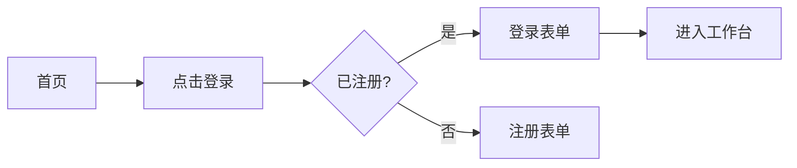

# UI/UX 设计技能（design-skill）

将 `.nds/<req-id>/01-requirements/` 的需求转化为**机器可读的契约化设计规范**——令牌驱动、组件 API 化、模式共享化，让开发能零歧义实现。

## 何时触发

- 用户输入 `/nzw-design`
- 自然语言提到"UI 设计/UX 设计/设计规范/设计令牌/高保真稿"等
- workflow-skill 在闭环中进入 design 阶段

## 工作目录与状态

产出落到 `.nds/<req-id>/02-design/`：
- `design-tokens.json` — W3C Design Tokens Format Module（2025.10 Stable）三层令牌
- `design-spec.md` — 设计规范主体（10 段）
- `components/` — 每个组件一个 `.md`（规格）+ `.html`（高保真样例）
- `patterns/` — 模式库（组件组合，区别于组件库）
- `information-architecture.md` — 站点/导航树 + 内容分类
- `user-flows.md` — 用户流程图（mermaid）
- `hifi-pages/` — 关键页面高保真 HTML
- `interaction-notes.html` — 交互说明（HTML，可在浏览器查看）

入口动作：
1. 读 `.nds/index.json` 确定 `active_req_id`（或 `--req <id>`），再读 `.nds/<req-id>/state.json`，确认 `phases.requirements.status == "done"`（否则提示先做需求）。
2. 读 `references/impeccable-design.md` 并按其「0. 前置」检测/安装 impeccable；失败则降级。
3. `project.current_phase = "design"`，`phases.design.status = "in_progress"`；同步回写 `index.json`。
4. 完成后向 `events[]` append `{type:"phase_done", phase:"design"}`，更新 state.json 与 PROGRESS.md。

## 主导思想

**"Tokens as contract, Components as API, Patterns as language."** 设计规范是机器可读契约而非 PDF；令牌是设计意图与代码实现间的协议层；组件是带版本号的 API；模式是团队共享语言。目标：单向数据流 + 可逆向同步（design ↔ code），消除"设计稿与代码漂移"。

## 设计执行引擎：impeccable

本技能负责契约层；视觉与交互的实现层委托 impeccable。完整集成指南（前置安装、分支判定、输出映射、精要规则）见 `references/impeccable-design.md`——进入设计实现前必读。核心分支：已有项目走 identity-preservation（复用既有令牌/组件 API），新项目从零按 OKLCH 设计。

## 执行流程

### 1. 设计令牌（design-tokens.json）

遵循 **W3C Design Tokens Format Module（2025.10 Stable）**，三层结构（reference/system/component）。用 `$type` 分组继承减少重复（组声明 `$type`，子令牌继承），用 `$extensions` 携带工具元数据（如 impeccable 色策略标记）而不破坏互操作：

```json
{
  "$description": "项目设计令牌（W3C DTCG 2025.10 Stable）",
  "color": {
    "reference": { "$type": "color",
      "slate-500": { "$value": "#64748b" },
      "slate-900": { "$value": "#0f172a" } },
    "system": { "$type": "color",
      "text-primary":   { "$value": "{color.reference.slate-900}" },
      "text-subtle":    { "$value": "{color.reference.slate-500}" },
      "bg-canvas":      { "$value": "#ffffff" },
      "bg-canvas-dark": { "$value": "{color.reference.slate-900}" } },
    "component": {
      "button": { "primary": { "bg": { "$value": "{color.system.accent}" } } } }
  },
  "dimension": { "$type": "dimension",
    "spacing": { "scale": { "$value": "4px" } },
    "radius":  { "md": { "$value": "8px" } } },
  "font": {
    "family": { "sans": { "$value": "system-ui, sans-serif", "$type": "fontFamily" } } },
  "duration": { "fast": { "$value": "150ms", "$type": "duration" } }
}
```

> 为什么三层 + `$type` 继承 + `$extensions`：Reference→System→Component 分层禁止跨层跳跃（component 不得直接引 reference），保证改色板能级联生效；`$type` 分组继承省去每个令牌重复声明类型；`$extensions` 让 impeccable 色策略等工具元数据随令牌流转而不污染 W3C 互操作。令牌文件顶部标注对齐的 DTCG 版本，让下游 dev-skill 知道按哪版规范解析。

### 2. 设计规范文档（design-spec.md，10 段）

```markdown
# {{项目名}} 设计规范
## 1. 设计原则（3-5 条：清晰/一致/反馈/包容）
## 2. 设计令牌引用说明（指向 design-tokens.json，标注 W3C DTCG 2025.10 Stable）
## 3. 布局系统（栅格/间距/断点/容器查询 container query）
## 4. 排版系统
## 5. 色彩系统（含暗色模式重映射规则）
## 6. 图标系统
## 7. 动效系统
## 8. 无障碍策略（WCAG 2.2 AA 起步）
## 9. 组件清单（指向 components/）
## 10. 模式清单（指向 patterns/）
```

### 3. 组件规格（components/<name>.md，六段齐全）

```markdown
# Button 组件
## Anatomy（解剖：container/label/leadingIcon?/trailingIcon?）
## States（强制覆盖 default/hover/focus-visible/active/disabled/loading/empty/error）
| 状态 | 视觉 | 行为 |
## Props API（Prop/类型/默认/说明）
## Variants 矩阵（variant × size × state 全组合）
## A11y 行为（role/键盘/焦点/对比度）
## Do / Don't
```

> 为什么 States 强制含 loading/empty/error/disabled：2025 年前端交付默认要求（参考 shadcn/Radix）。少一个状态，开发就会用占位实现，上线后这些状态裸奔——而 loading/empty/error 恰是用户最焦虑的时刻。配套 `components/<name>.html` 高保真样例用真实令牌、真实数据。

### 4. 模式库（patterns/，一等产物）

Nielsen Norman Group 明确区分**组件库**（单个 UI 元素）与**模式库**（元素组合/布局）。模式是开发者最常复用、最易漂移的部分。每个模式一个 `.md`：

```markdown
# 模式：表单 + 校验
## 组成（TextField + Button + InlineError）
## 何时用 / 何时不用
## 交互时序（失焦校验/提交校验/异步校验）
## 空状态/错误状态/加载状态
## A11y（aria-live 区域承载错误）
```

典型模式：表单+校验、列表+筛选+空状态、详情+编辑切换、向导多步、确认对话框+破坏性操作。

### 5. 信息架构（information-architecture.md）

站点/导航树 + 内容分类。与 user-flows 互补：IA 回答"内容怎么分类组织"，flow 回答"用户怎么走完任务"——避免"有流程但页面层级混乱"。

### 6. 用户流程图（user-flows.md）

mermaid 表达关键流，每条 flow 对应 PRD 中的 Story ID：


```mermaid
flowchart LR
  Entry[首页] --> Action[点击登录]
  Action --> Decision{已注册?}
  Decision -->|是| Login[登录表单]
  Decision -->|否| Register[注册表单]
  Login --> Exit[进入工作台]
```

### 7. 高保真页面（hifi-pages/）

每个关键页面一个 HTML，浏览器直开：真实令牌（从 design-tokens.json 读 CSS 变量）、真实数据样例（不用 Lorem ipsum）、响应式（≥3 断点）、暗色模式切换、无障碍（对比度/焦点/aria）。

### 8. 交互说明（interaction-notes.html）

HTML 形式，含：微交互（hover/click/loading/error）、表单校验时机与文案、空/错/载状态、路由跳转规则、动效时长与缓动。

## 完成判定

- design-tokens.json 通过 JSON 校验，三层齐全，用 `$type` 分组继承，标注 DTCG 2025.10 Stable
- design-spec.md 含 10 段
- 组件规格六段齐全，States 覆盖 loading/empty/error/disabled；组件清单覆盖 PRD 所有 Must 级 Story 涉及的 UI
- `patterns/` 至少含 3 个核心模式
- `information-architecture.md` 产出
- 至少 3 个高保真页面，含暗色模式
- 已过 impeccable「绝对禁止」清单与 AI slop 测试（或降级模式下过精要规则同等检查）
- 已有项目分支：`design-tokens.json` 保留原项目命名与色值，新页面与既有风格一致
- user-flows.md 覆盖主用户流
- state.json：`phases.design.status = "done"`，`events[]` append phase_done
- `resume_hint` 建议进入 review 阶段（`/nzw-review`）

## 与上下游交接

- 输入：`.nds/<req-id>/01-requirements/PRD.md`、`prototype.html`、`story-map.md`
- 输出给 review-skill：design-spec.md + components/ + patterns/ + hifi-pages/ 是三维评审中 UX 可实现性维度的对象
- 输出给 dev-skill：design-tokens.json 与组件规格（含 States 四态）是开发实现的契约
