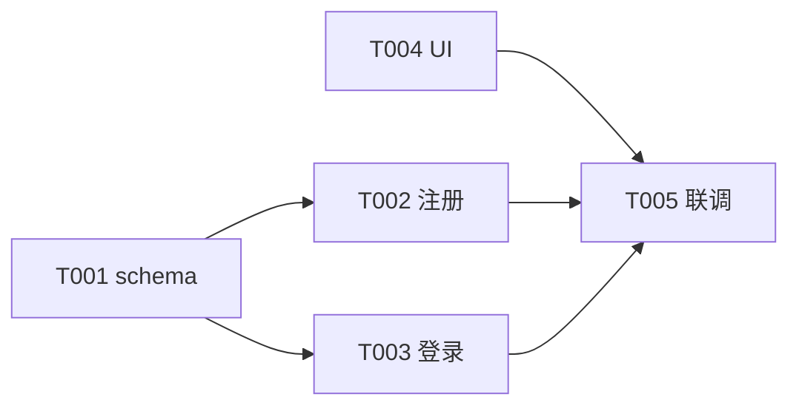

# 任务拆分与跟踪技能（task-allocation-skill）

把评审通过的方案分解为**Small、Vertical、Verifiable** 的增量任务，依赖关系建模为 DAG，状态机闭环跟踪到交付。

主导思想：**任务拆分的本质是降低不确定性**——每完成一个任务，系统可工作、可验证、可回滚。AI 时代把"可验证"推到"机器可验证"，使任务成为 agent 与人类的共享契约。

## 何时触发

- 用户输入 `/nzw-task`
- 自然语言提到"任务拆分/WBS/排期/看板"等
- workflow-skill 在闭环中进入 tasks 阶段

## 工作目录与状态

**路径约定（v1.1）**：所有产出相对 `.nds/<active-req-id>/`，例如 `.nds/req-001/04-tasks/`。需求隔离见顶层 `.nds/index.json`。任务 ID（`T001` 等）在需求内自增即可，无需跨需求唯一。

产出落到 `.nds/<req-id>/04-tasks/`：
- `WBS.md` — 工作分解结构（Epic → Feature → Task 三层）
- `task-tree.json` — 任务树（机器可读，同步到 state.json 的 `task_tree`）
- `schedule.md` — 排期表（甘特/看板视图）
- `dependencies.mmd` — 依赖关系图（mermaid DAG）

入口动作：
1. 读取 `.nds/index.json` 确定 `active_req_id`（或用 `--req <id>` 指定），再读 `.nds/<req-id>/state.json`，确认 `phases.review.status == "done"`
2. `project.current_phase = "tasks"`，`phases.tasks.status = "in_progress"`；同步回写 `index.json` 中该 req 的 `current_phase`/`updated_at`
3. 任务树同步写入 state.json 的 `task_tree.tasks`

## 主导思想

- **Small, vertical, verifiable increments**：每任务 ≤ 1 人天（理想 ≤ 4h），垂直切片而非水平分层
- **dependencies explicit**：依赖显式建模为 DAG，禁止循环
- **flow over batch**：进度跟踪的目标是暴露瓶颈、缩短 feedback loop，而非报表
- **契约化**：任务描述含「上下文文件 + 输入契约 + 输出契约 + 验证命令」四要素

## 执行流程

### 1. 工作分解（WBS）

自顶向下 3 层为限：
- **Epic**：对应 PRD 中一个 Must 级 Feature
- **Feature**：可独立交付的垂直切片
- **Task**：叶节点，一个 agent 单次会话可完成

`WBS.md` 结构：

```markdown
# WBS

## Epic E01 - 用户认证
### Feature F01.1 - 注册登录
- Task T001 - 设计 User schema [backend] → depends_on: -
- Task T002 - 实现注册 API [backend] → depends_on: T001
- Task T003 - 实现登录 API [backend] → depends_on: T001
- Task T004 - 登录页 UI [frontend] → depends_on: -
- Task T005 - 集成联调 [fullstack] → depends_on: T002,T003,T004
```

### 2. 任务四要素契约（task-tree.json）

每个任务严格包含四要素：

```json
{
  "id": "T002",
  "title": "实现注册 API",
  "phase": "dev",
  "status": "todo",
  "depends_on": ["T001"],
  "assignee": "dev-skill",
  "context_files": [".nds/<req-id>/01-requirements/PRD.md#F001", ".nds/<req-id>/02-design/components/api-spec.md"],
  "input_contract": "User schema (T001 产出)，注册字段定义见 PRD F001",
  "output_contract": "POST /api/register 返回 201 与 user 对象；重复邮箱返回 409",
  "verification_cmd": "pnpm test src/api/register.test.ts",
  "artifacts": [],
  "bug_ids": [],
  "estimate_hours": 2,
  "started_at": null,
  "completed_at": null
}
```

### 3. INVEST 检查

每条任务检查：
- **I**ndependent：尽量独立
- **N**egotiable：可协商
- **V**aluable：有价值
- **E**stimable：可估算
- **S**mall：≤ 4h
- **T**estable：有 verification_cmd

不达标的继续拆。粒度过细（< 15min）的聚合到一个含多步的 task。

### 4. 依赖 DAG

`dependencies.mmd`：



校验：
- 无循环依赖（拓扑排序可成）
- 关键路径标记（最长依赖链）
- 非 critical path 任务配 buffer

### 5. 排期表（schedule.md）

```markdown
# 排期表

## 看板视图
| Todo | Doing | Review | Done |
|---|---|---|---|
| T006 | T002 | T001 | — |

## 甘特视图（按依赖顺序）
| 任务 | 预估 | 开始 | 结束 | 依赖 |
|---|---|---|---|---|
| T001 | 1h | D1 09:00 | D1 10:00 | - |
| T002 | 2h | D1 10:00 | D1 12:00 | T001 |
| ... |

## 关键路径
T001 → T002 → T005 → T008（总 8h）
```

### 6. 状态机

```
Todo → Doing → Review → Done
         ↑       ↓
         └─ Blocked
```

转换规则：
- `Todo → Doing`：开发者认领
- `Doing → Review`：开发者完成 + verification_cmd 通过
- `Review → Done`：测试通过
- `Review → Doing`：测试反馈 bug
- `Doing → Blocked`：遇到阻塞，需 reason + owner + unblock date

## 必须遵守的规则

1. **INVEST 必过**：不达标的任务继续拆。
2. **粒度上限**：单任务 ≤ 1 人天，理想 ≤ 4h。
3. **DoD 显式**：每个任务必须含 `verification_cmd`，可自动化验证优先。
4. **DAG 无环**：禁止循环依赖，关键路径任务显式标记。
5. **状态机单向**：blocked 例外，禁止跳过 Review。
6. **四要素齐全**：context_files / input_contract / output_contract / verification_cmd 缺一不可。

## 完成判定

- WBS.md 含全部 Epic → Feature → Task
- task-tree.json 中所有任务含四要素
- dependencies.mmd 拓扑排序无环
- schedule.md 含看板 + 甘特 + 关键路径
- state.json 的 `task_tree.tasks` 已同步
- `phases.tasks.status = "done"`
- `resume_hint` 建议进入 dev 阶段（`/nzw-dev` 按 task-tree 顺序执行）

## 与上下游交接

- 输入：`.nds/<req-id>/03-review/sign-off.md` 已签字
- 输出给 dev-skill：task-tree.json 是开发按序执行的清单
- 输出给 test-skill：每个任务的 `output_contract` 是测试用例设计的依据
